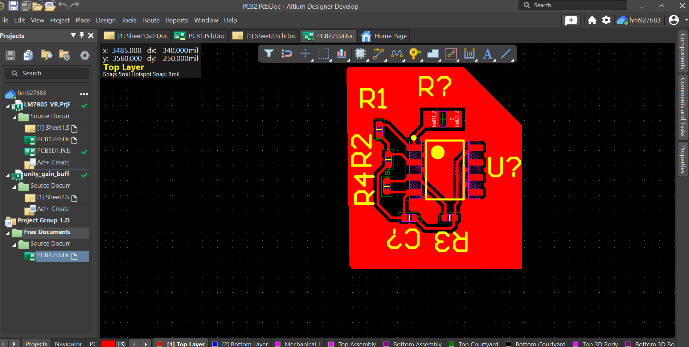
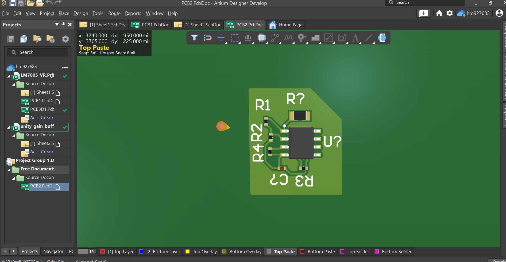
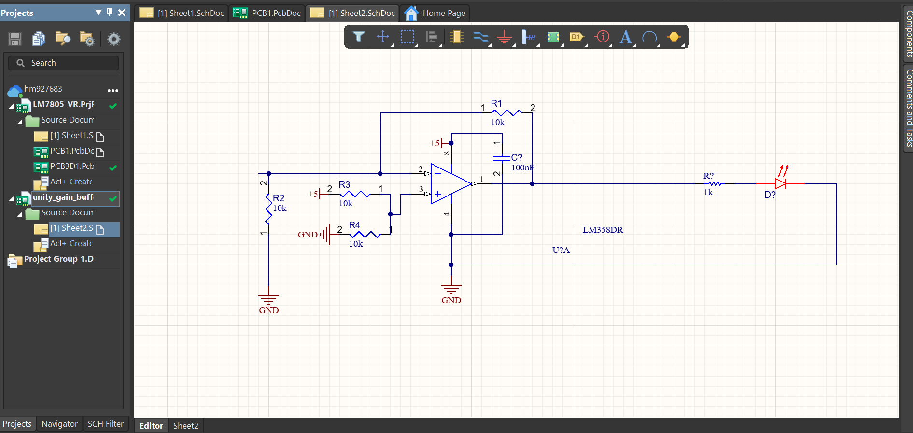

# Unity-Gain-Buffer-LM358-PCB-Design-
# LM358 Op-Amp PCB Design

## Overview
Designed a 2-layer PCB using LM358 for signal buffering and LED indication.

## Features
- Unity gain buffer configuration
- Proper decoupling (100nF capacitor)
- 2-layer PCB routing with vias
- LED output indication

## Tools Used
- Altium Designer

## Images

### PCB Layout

### 3D View

### Schematic

## Files
- Schematic
- PCB Layout
- Project files

## How to Use
1. Open project files in Altium Designer
2. Review schematic and PCB layout
3. Modify as needed for your application
